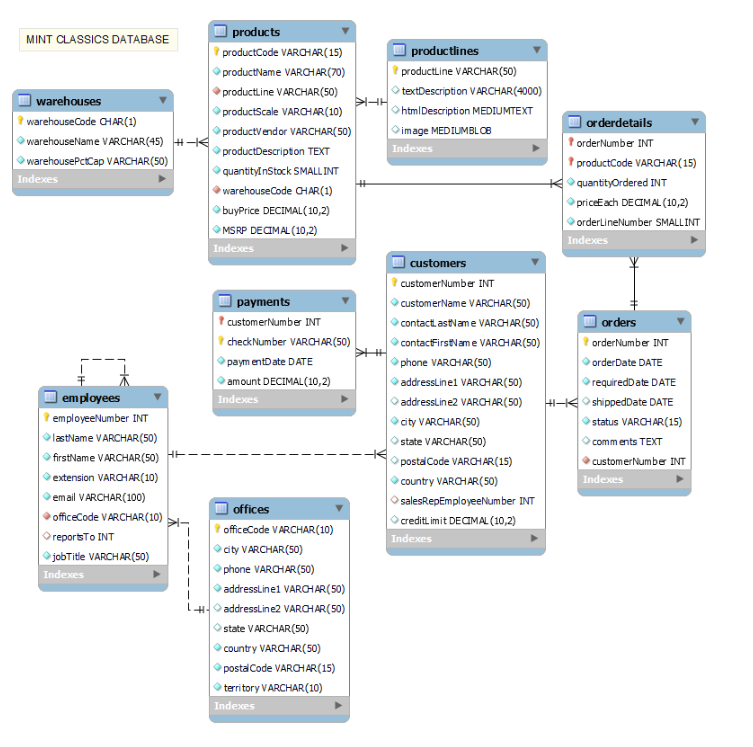
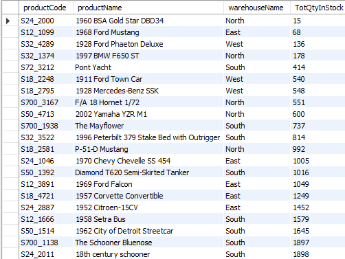
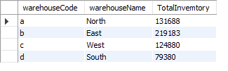
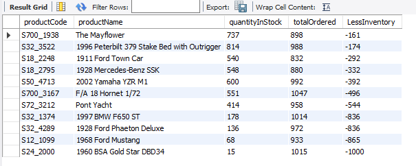
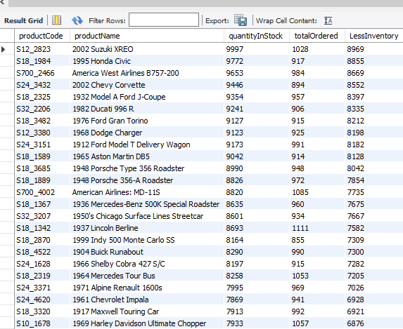

# Model-Vehicle-Company-Data-Analysis

## Project Overview
The following analysis aims to anable Mint Classics Company, a retailer of classic model cars and other vehicles, address inventory and storage facility-related issues. The company needs to make a desicion on closing one of the existing storage facilities and is therefore looking for suggestions and recommendations for reorganizing or reducing inventory, while still maintaining timely service to their customers.

### Tools Used
1.MSQL Workbench - This tool is used to Import Mintclassic Database, query the database and analysis of data.

2.Github - This project uploaded on Github as a portfolio project.

### Method

The following are the steps taken through the task execution process.

1 - Import Classic Car Model Database

2 - Understanding the Mint Classics Database and Its Business Processes

3 - Exploratory

4 - Formulating Recommendations to Address Business Issues

5 - Crafting Conclusions and Recommendations with SQL Support


### Understanding the Mint Classics and Its Business Processes

Once I imported Mint classics database into MSQL Workbench, the next step is to understand how it's tables are related to each others and contents of each table.

Below is an image of the database table columns and connections.



### Exploratory Data Analysis

The following Analysis will be conducted on the following;

* Are all the warehouses currently is use needed. What is the total inventory of each warehouse?
* Are there products with high stock levels but low sales? Are there products with less inventory than Pending Orders?
* What is the comparison of various product lines?
* Is there a relationship between prices and there sales levels?
* Who are the customers contributing the most sales?
* What is the analysis of customer payment trends and what credit risks need to be considered?
* How can company credit policies be evaluated? Are there any customers with credit issues that need to be addressed?
* Can the perfomance of employees be evaluated using available sales data?

### Are all the warehouses currently is use needed? What is the total inventory of each warehouse?

Using MSQL query to retrieve total inventory of each product in each warehouse. The query joins two tables in the Mint Classic databse, the Prouducts table and warehouses table based on the warehouse code
``` SQL
select p.productCode,
       p.productName,
       w.warehouseName,
       sum(p.quantityInStock) as TotQtyInStock
from mintclassics.products as p
join mintclassics.warehouses w on p.warehouseCode = w.warehouseCode
group by  p.productCode,
       p.productName,
       w.warehouseName
order by TotQtyInStock 
```
The query shows the total inventory of each product in each warehouse and sorts it from the smallest to the largest.



Looking the the total stocks for each warehouse. The query performs a left join between the warehouses table and the products table based on the warehouse code.
``` SQL
select 
w.warehouseCode,
w.warehouseName,
sum(p.quantityInstock) AS TotalInvemtory
from 
  mintclassics.warehouses w
Left join 
mintclassics.products p on w.warehouseCode = p.warehouseCode
group by 
w.warehouseCode,
w.warehouseName
;
```
The result is the number of stocks in each warehouse as shown in the screenshot below.



### Are there products with high stock levels but low sales? Are there products with more stocks than Orders?

Using SQL query to retrieves data from the products table and order details from the orderdetails table. The query then groups the data by product code, product name, and the quantity of the product available in stock. Next, the query calculates the total quantity of the product ordered by combining data from both tables. The query the finds the difference between Total stocks and total ordered  as InventoryLessOrders. The query then limits the result to only Pending Orders that have less stocks compared to what was ordered.

```sql
select productCode,
productName,
quantityInStock,
totalOrdered,
(quantityInStock - totalOrdered) as LessInventory
from 
 ( select p.productCode,
          p.productName,
          p.quantityInStock,
          sum(od.quantityOrdered) as totalOrdered
	from 
    mintclassics.products p
    left join mintclassics.orderdetails od on od.productCode = p.productCode
  
    Group by p.productCode,
			 p.productName,
			 p.quantityInStock
   ) as StocksInfo
where 
     (quantityInStock - totalOrdered)  < 0
order by LessInventory desc
```

The result is a record of products that need replenishment in order to meet market requirement.



A modification of the above code in the where statement to show records whose difference is greater than 0 returns products with high stock levels but low sales

```sql
select productCode,
productName,
quantityInStock,
totalOrdered,
(quantityInStock - totalOrdered) as LessInventory
from 
 ( select p.productCode,
          p.productName,
          p.quantityInStock,
          sum(od.quantityOrdered) as totalOrdered
	from 
    mintclassics.products p
    left join mintclassics.orderdetails od on od.productCode = p.productCode
  
    Group by p.productCode,
			 p.productName,
			 p.quantityInStock
   ) as StocksInfo
where 
     (quantityInStock - totalOrdered)  > 0
order by LessInventory desc
```


### What is the comparison of various product lines?

Looking into which product lines are more successful and which ones need improvement or removal. I use the following query to retrieve data about various product lines along with related information.The query joins the products table with the product lines table using a RIGHT JOIN based on the “productLine” column. This allows us to combine product information with the corresponding product line descriptions.The query then calculates the Total Revenue (TotRevenue) and The percenatge of sales versus Inventory (SalestoInventoryPct) based of the total stocks and Total sales.

```SQL
use mintclassics;

select 
pl.productLine,
sum(p.quantityInStock) as TotStock,
sum(od.quantityOrdered) as TotSales,
sum(od.priceEach * od.quantityOrdered) as TotRevenue,
(sum(od.quantityOrdered)/sum(p.quantityInStock)) * 100 as SalestoInventoryPct
from productlines pl
right join
products p on pl.productLine = p.productLine
right join
orderdetails od on p.productCode = od.productCode
group by
pl.productLine,
pl.textDescription
order by
SalestoInventoryPct desc

```
The result shows the performance of various product lines, which product lines have the highest sales percentage, and how each product line performs in terms of inventory and sales.
