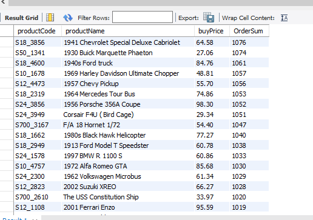
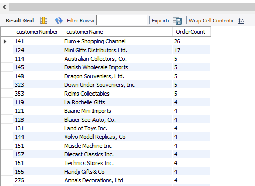
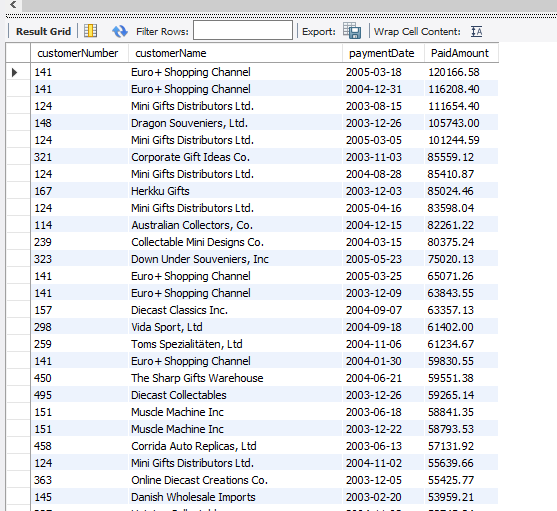
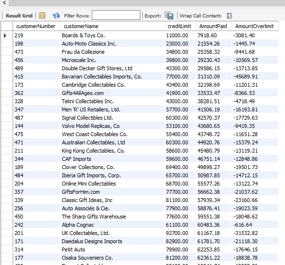
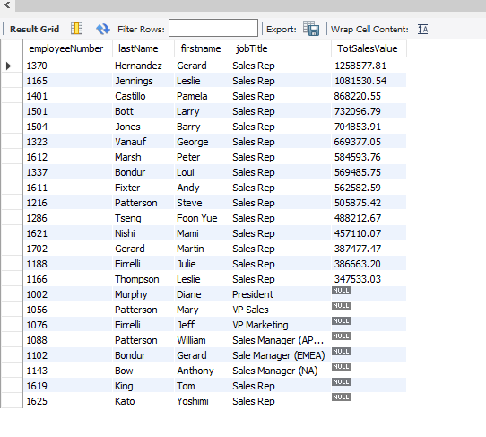

# Model-Vehicle-Company-Data-Analysis Using MYSQL

## Project Overview
The following analysis aims to anable Mint Classics Company, a retailer of classic model cars and other vehicles, address inventory and storage facility-related issues. The company needs to make a desicion on closing one of the existing storage facilities and is therefore looking for suggestions and recommendations for reorganizing or reducing inventory, while still maintaining timely service to their customers.

### Tools Used
1.MSQL Workbench - This tool is used to Import Mintclassic Database, query the database and analysis of data.

2.Github - This project uploaded on Github as a portfolio project.

### Method

The following are the steps taken through the task execution process.

1 - Import Classic Car Model Database

2 - Understanding the Mint Classics Database and Its Business Processes

3 - Exploratory Data Analysis

4 - Findings and Recommendations

5 - Conclusion


### Understanding the Mint Classics and Its Business Processes

Once I imported Mint classics database into MSQL Workbench, the next step is to understand how it's tables are related to each others and contents of each table.

Below is an image of the database table columns and connections.


### Exploratory Data Analysis

The following Analysis will be conducted on the following;

* Are all the warehouses currently is use needed. What is the total inventory of each warehouse?
* Are there products with high stock levels but low sales? Are there products with less inventory than Pending Orders?
* What is the comparison of various product lines?
* Is there a relationship between prices and there sales levels?
* Who are the customers contributing the most sales?
* What is the analysis of customer payment trends and what credit risks need to be considered?
* How can company credit policies be evaluated? Are there any customers with credit issues that need to be addressed?
* Can the perfomance of employees be evaluated using available sales data?

### Are all the warehouses currently is use needed? What is the total inventory of each warehouse?

Using MSQL query to retrieve total inventory of each product in each warehouse. The query joins two tables in the Mint Classic databse, the Prouducts table and warehouses table based on the warehouse code
``` SQL
select p.productCode,
       p.productName,
       w.warehouseName,
       sum(p.quantityInStock) as TotQtyInStock
from mintclassics.products as p
join mintclassics.warehouses w on p.warehouseCode = w.warehouseCode
group by  p.productCode,
       p.productName,
       w.warehouseName
order by TotQtyInStock 
```
The query shows the total inventory of each product in each warehouse and sorts it from the smallest to the largest.


Looking the the total stocks for each warehouse. The query performs a left join between the warehouses table and the products table based on the warehouse code.
``` SQL
select 
w.warehouseCode,
w.warehouseName,
sum(p.quantityInstock) AS TotalInvemtory
from 
  mintclassics.warehouses w
Left join 
mintclassics.products p on w.warehouseCode = p.warehouseCode
group by 
w.warehouseCode,
w.warehouseName
;
```
The result is the number of stocks in each warehouse as shown in the screenshot below.


### Are there products with high stock levels but low sales? Are there products with more stocks than Orders?

Using SQL query to retrieves data from the products table and order details from the orderdetails table. The query then groups the data by product code, product name, and the quantity of the product available in stock. Next, the query calculates the total quantity of the product ordered by combining data from both tables. The query the finds the difference between Total stocks and total ordered  as InventoryLessOrders. The query then limits the result to only Pending Orders that have less stocks compared to what was ordered.

```sql
select productCode,
productName,
quantityInStock,
totalOrdered,
(quantityInStock - totalOrdered) as LessInventory
from 
 ( select p.productCode,
          p.productName,
          p.quantityInStock,
          sum(od.quantityOrdered) as totalOrdered
	from 
    mintclassics.products p
    left join mintclassics.orderdetails od on od.productCode = p.productCode
  
    Group by p.productCode,
			 p.productName,
			 p.quantityInStock
   ) as StocksInfo
where 
     (quantityInStock - totalOrdered)  < 0
order by LessInventory desc
```

The result is a record of products that need replenishment in order to meet market requirement.


A modification of the above code in the where statement to show records whose difference is greater than 0 returns products with high stock levels but low sales

```sql
select productCode,
productName,
quantityInStock,
totalOrdered,
(quantityInStock - totalOrdered) as LessInventory
from 
 ( select p.productCode,
          p.productName,
          p.quantityInStock,
          sum(od.quantityOrdered) as totalOrdered
	from 
    mintclassics.products p
    left join mintclassics.orderdetails od on od.productCode = p.productCode
  
    Group by p.productCode,
			 p.productName,
			 p.quantityInStock
   ) as StocksInfo
where 
     (quantityInStock - totalOrdered)  > 0
order by LessInventory desc
```


### What is the comparison of various product lines?

Looking into which product lines are more successful and which ones need improvement or removal. I use the following query to retrieve data about various product lines along with related information.The query joins the products table with the product lines table using a RIGHT JOIN based on the “productLine” column. This allows us to combine product information with the corresponding product line descriptions.The query then calculates the Total Revenue (TotRevenue) and The percenatge of sales versus Inventory (SalestoInventoryPct) based of the total stocks and Total sales.

```SQL
use mintclassics;

select 
pl.productLine,
sum(p.quantityInStock) as TotStock,
sum(od.quantityOrdered) as TotSales,
sum(od.priceEach * od.quantityOrdered) as TotRevenue,
(sum(od.quantityOrdered)/sum(p.quantityInStock)) * 100 as SalestoInventoryPct
from productlines pl
right join
products p on pl.productLine = p.productLine
right join
orderdetails od on p.productCode = od.productCode
group by
pl.productLine,
pl.textDescription
order by
SalestoInventoryPct desc

```
The result shows the performance of various product lines, which product lines have the highest sales percentage, and how each product line performs in terms of inventory and sales.


### Is there a relationship between prices and there sales levels?

The following query retrieves the product code, product name, purchase price (buyPrice), and the total quantity ordered (OrderSum). The query runs on products table  and the orderdetails table .Using GROUP BY enables us to calculate the total quantity of products ordered (OrderSum) for each product, along with its purchase price and other details.

```sql
select 
p.productCode,
p.productName,
p.buyPrice,
sum(od.quantityOrdered) as OrderSum
from 
mintclassics.products p
left join 
orderdetails od on p.productCode = od.productCode
Group by
p.productCode,
p.productName,
p.buyPrice
order by  ordersum desc
```



### Who are the customers contributing the most sales?

I use the following query to retrieve customer data, including customer number (customerNumber), customer name (customerName), and total sales (totalSales) made by each customer. It operates on the customers table and the orders table. Using a left join on Prduct Code, the query combines customer information with related order information.The query then uses Group By to obtain a count of total sales made by each customer.The query results are sorted (ORDER BY) in descending order (from highest to lowest) based on total sales (totalSales), resulting in a list of customers sorted by the highest total sales at the top.

```sql
select 
c.customerNumber,
c.customerName,
count(os.orderNumber) as OrderCount
from 
mintclassics.customers c
left join 
orders os on c.customerNumber = os.customerNumber
group by
c.customerNumber,
c.customerName
order by
OrderCount desc
;
```



### What is the analysis of customer payment trends and what credit risks need to be considered?

The following query retreieves customer data (customers) and payment information (payments) associated with each customer. The data retrieved includes customer number (customerNumber), customer name (customerName), payment date (paymentDate), and payment amount (paymentAmount). A LEFT JOIN between the customers table and the payments table  based on the customer number allows us to combine customer information with payment data related to each customer.

```SQL
select 
c.customerNumber,
c.customerName,
p.paymentDate,
p.amount as PaidAmount
from customers c
Left join 
payments p on c.customerNumber = p.customerNumber
order by
PaidAmount desc
;
```
By using this query, you can view a list of customers along with the dates and the largest payment amounts they have made. This helps in the analysis customer payment trends and identify customers with the highest payment amounts.



### How can company credit policies be evaluated? Are there any customers with credit issues that need to be addressed?

The following query fetches customer data (customers) and related information, including customer number (customerNumber), customer name (customerName), credit limit (creditLimit), total payments made (totalPayments), and the difference between total payments and the credit limit (creditLimitDifference).The query groups  (GROUP BY) based on customer number (customerNumber) and credit limit (creditLimit). This means the data will be grouped for each customer and their credit limit value.Then, the HAVING clause is used to filter the query results. Only customer data with total payments (totalPayments) less than the credit limit (creditLimit) will be retrieved. This means only customers who have not paid their entire credit limit will be displayed.

```sql
select 
c.customerNumber,
c.customerName,
c.creditLimit,
sum(p.amount) as AmountPaid,
(sum(p.amount) - c.creditLimit) as AmountOverlimit
from
customers c
left join
payments p on c.customerNumber = p.customerNumber
Group by
c.customerNumber,
c.creditLimit
Having
sum(p.amount) < c.creditLimit
order by
AmountPaid;
```



### Can the perfomance of employees be evaluated using available sales data?

The following query is used to retrieve employee data. The query uses a left join to connect the employee table, customer table, orders table and Orderdetails table. We multiply the PriceEach column wth ordered quantity to obtain the Total Sales value. The query the Groups the customer details to find the total sales values associated with each employee.

```sql
select
e.employeeNumber,
e.lastName,
e.firstname,
e.jobTitle,
sum(od.priceEach * od.quantityOrdered)  as TotSalesValue
from 
mintclassics.employees e
LEFT join 
mintclassics.customers c on e.employeeNumber = c.salesRepEmployeeNumber
left join
mintclassics.orders os on c.customerNumber = os.customerNumber
left join
mintclassics.orderdetails od on  od.orderNumber = os.orderNumber
group by
e.employeeNumber,
e.lastName,
e.firstname,
e.jobTitle
order by TotSalesValue desc ;
```



### Findings and Recommendations

1.  **Warehouse Inventory**

An anlysis of the total stocks in each warehouse and that of sales versus quantity in stock shows that there are warehouses with low or inactive inventory. I recommend conducting further reviews of these warehouses. Consider merging inactive warehouses or closing them.

2. **Product Stocks**

From the analysis of products Sales and quantity in stock, the results shows that there select items that are currently understocked and a majority of items whose sales are low compared to there high stock levels. Irecommend restocking the items that are in demand.
For those Items whose inventory is high compared to sales, I recommend reducing the inventory of these products by either reducing the quantity ordered for these products or evaluating the actual demand for them.

3. **Product Line Analysis**

The analysis has shown the performance of various Product lines. Classic cars, Vintage cars and Motocycles are the leading Product Lines in terms of revenue generated. Planes, Ships and Trains are the least selling product Lines by Revenue generated. These Product lines with less success need further evaluation.Consider product improvements or, if necessary, discontinuation of inefficient products. This will help in enhancing the profitability of the product offering.

4. **Product Prices Versus Sales Value**

The analysis reveals a relationship between price and sales perfomance. There is need to carefully review product prices. I recommend adjusting the prices of items with low sales as this can increase the appeal of these items to customers and lead to a boost in sales.

5. **Customer Sales Analysis**

The analysis of customer sales shows that Euro+ Shopping Channel and Mini Gifts Distributors Ltd are the main sales contributors. I recommend focusing sales efforts to these valuable customers by providing Discounts and offering products that allign with their interests.

6. **Customer Payment Trends**

From the analysis of payment trends of the customers, I recommend A regular follow up of customer payments. Take follow-up actions on customers I dentified to have poor payment trends in order to mitigate risks.

7. **Company Credit Policies**

An anlysis of the Customer Credit Limit and Amount overlimit has been done. I recommend a review of the credit policy for each customer. In order to mitigate risks, Identify customers with credit issues and make changes to there policy.

8. **Employee versus Sales**

An analysis of the sales made associated to the employees shows that there are Sales that have hugely contributed to the sales made. This findings can be used to measure employee perfomance. I recommend looking into employees who have achieved or exceeded sales targets and rewarding them with incentives. Additionally, identify employees who may need improvement and provide necessary training or support.

#### Conclusion 

By following these recommendations and involving data analysis, the company can optimize its operations, improve profitability, and provide better customer service.


